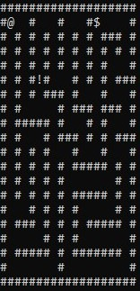

# MazeAStar

Проект MazeAStar — реализация алгоритма A* для поиска кратчайшего пути в лабиринте.

## Описание

MazeAStar — это простой и эффективный алгоритм поиска пути, который позволяет находить кратчайший путь от стартовой точки до цели в двумерном лабиринте. Алгоритм A* — один из самых популярных и широко используемых в задачах навигации.

## Особенности

- Используется алгоритм A* для поиска кратчайшего пути.
- Можно создавать разные лабиринты с препятствиями.
- Враги умно двигаются к игроку, находя кратчайший путь.
- Легко менять настройки лабиринта и начальные позиции.
- Игра показывается прямо в консоли с обновлением экрана.

## Основные компоненты

- **Конфигурация** (`Config/`): содержит параметры лабиринта, такие как размеры, расположение стен и начальные позиции юнитов.

- **Основная логика** (`Core/`): реализация алгоритма A* и управление поиском пути.

- **Ввод** (`Input/`): обработка пользовательского ввода из консоли.

- **Отображение** (`Rendering/`): вывод лабиринта и состояния игры в консольном интерфейсе.

- **Юниты** (`Units/`): классы, представляющие игрока и врагов, а также их поведение.
